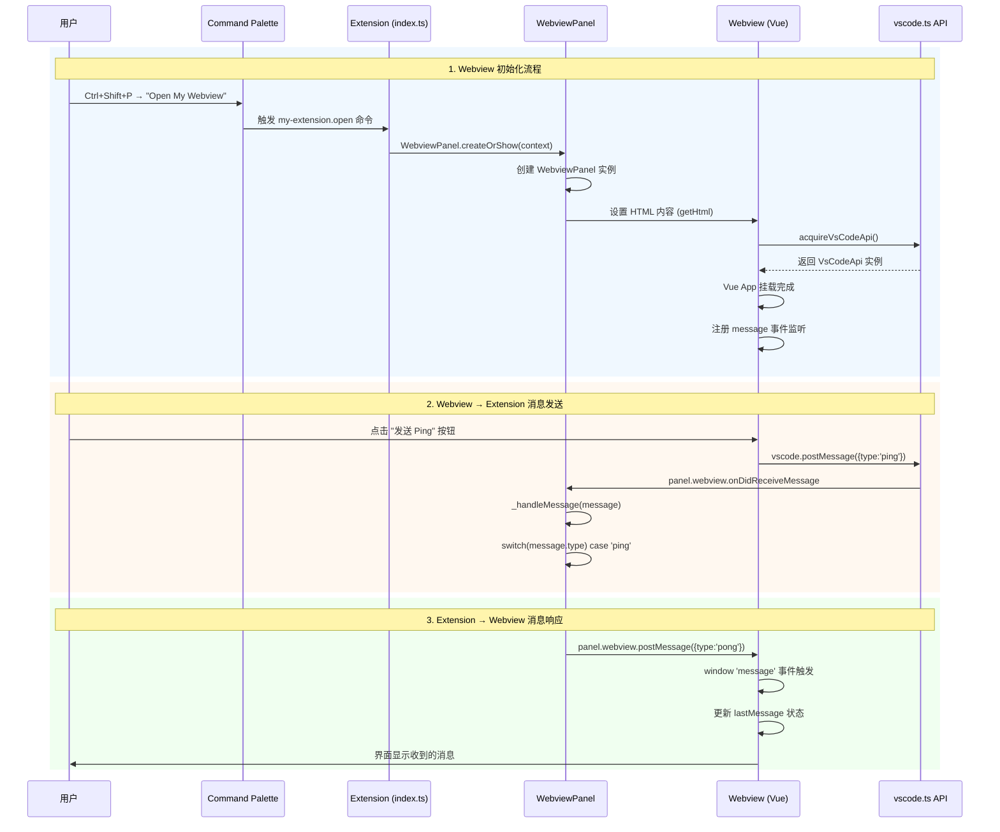
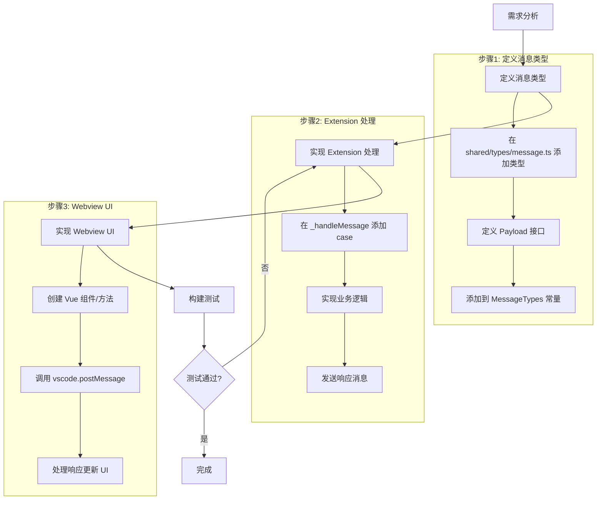

# Extension ↔ Webview 数据流通信机制

> 本文档详细说明 VS Code Extension 与 Webview 之间的数据流传输关系，帮助开发者理解并按规范实现功能点开发。

## 1. 流程概览

| 属性 | 说明 |
|------|------|
| 流程名称 | Extension ↔ Webview 双向通信 |
| 所属领域 | VS Code 扩展架构 |
| 涉及模块 | Extension 后端、Webview 前端、Shared 共享层 |
| 目标说明 | 建立 Extension 与 Webview 之间类型安全的双向消息通信机制 |

### 架构总览

```
┌────────────────────────────────────────────────────────────────┐
│                      VS Code Extension Host                     │
│  ┌──────────────────────────────────────────────────────────┐  │
│  │                     Extension (Node.js)                   │  │
│  │  ┌─────────────┐  ┌─────────────┐  ┌──────────────────┐  │  │
│  │  │   index.ts  │  │  commands/  │  │  webview/        │  │  │
│  │  │  (入口)     │──│ openWebview │──│  WebviewPanel.ts │  │  │
│  │  └─────────────┘  └─────────────┘  └────────┬─────────┘  │  │
│  │                                              │            │  │
│  │                              panel.webview.postMessage()  │  │
│  │                              panel.webview.onDidReceive   │  │
│  │                                    Message()              │  │
│  └──────────────────────────────────────────────┼────────────┘  │
│                                                 │               │
│  ═══════════════════════════════════════════════╪═══════════   │
│                        postMessage API          │               │
│  ═══════════════════════════════════════════════╪═══════════   │
│                                                 │               │
│  ┌──────────────────────────────────────────────┼────────────┐  │
│  │                     Webview (Browser)        │            │  │
│  │  ┌─────────────┐  ┌─────────────┐  ┌────────▼─────────┐  │  │
│  │  │   main.ts   │──│   App.vue   │──│  api/vscode.ts   │  │  │
│  │  │  (Vue入口)  │  │  (根组件)   │  │  (通信封装)      │  │  │
│  │  └─────────────┘  └─────────────┘  └──────────────────┘  │  │
│  └──────────────────────────────────────────────────────────┘  │
└────────────────────────────────────────────────────────────────┘

┌────────────────────────────────────────────────────────────────┐
│                        Shared Layer                             │
│  ┌──────────────────────────────────────────────────────────┐  │
│  │  shared/types/message.ts                                  │  │
│  │  - WebviewMessage<T> 接口                                 │  │
│  │  - MessageTypes 常量                                      │  │
│  └──────────────────────────────────────────────────────────┘  │
└────────────────────────────────────────────────────────────────┘
```

## 2. 流程步骤（时序）

### 2.1 通信时序图



### 2.2 关键步骤拆解

#### 步骤 1：Extension 激活与命令注册

```typescript
// extension/index.ts
export function activate(context: vscode.ExtensionContext) {
  context.subscriptions.push(
    vscode.commands.registerCommand('my-extension.open', () =>
      openWebview(context)  // 传递 context 用于资源访问
    )
  );
}
```

**关键点**：
- `ExtensionContext` 包含扩展路径、状态存储等关键信息
- 命令 ID 需与 `package.json` 中的定义一致

#### 步骤 2：创建 WebviewPanel

```typescript
// extension/webview/WebviewPanel.ts
const panel = vscode.window.createWebviewPanel(
  'myWebview',           // viewType 标识符
  'My Webview',          // 标题
  vscode.ViewColumn.One, // 显示位置
  {
    enableScripts: true,           // 允许执行 JS
    retainContextWhenHidden: true, // 隐藏时保持状态
    localResourceRoots: [          // 允许加载的本地资源目录
      vscode.Uri.joinPath(context.extensionUri, 'dist', 'webview')
    ]
  }
);
```

**关键点**：
- `enableScripts: true` 是通信的前提
- `localResourceRoots` 限制可加载资源的范围（安全性）
- `retainContextWhenHidden` 可保持 Webview 状态

#### 步骤 3：注入 HTML 与安全策略

```typescript
// extension/webview/getHtml.ts
const nonce = getNonce();  // 生成随机 nonce

return `<!DOCTYPE html>
<html>
<head>
  <meta http-equiv="Content-Security-Policy" 
        content="default-src 'none'; 
                 style-src ${webview.cspSource} 'unsafe-inline'; 
                 script-src 'nonce-${nonce}';">
  <script type="module" nonce="${nonce}" src="${scriptUri}"></script>
</head>
<body>
  <div id="app"></div>
</body>
</html>`;
```

**关键点**：
- CSP (Content Security Policy) 限制资源来源
- `nonce` 白名单机制确保只有授权脚本可执行
- `webview.asWebviewUri()` 转换本地路径为 Webview 可用的 URI

#### 步骤 4：Webview 获取 VS Code API

```typescript
// webview/src/api/vscode.ts
declare function acquireVsCodeApi(): VsCodeApi;

class VSCodeAPIWrapper {
  private readonly vsCodeApi: VsCodeApi | undefined;

  constructor() {
    if (typeof acquireVsCodeApi === 'function') {
      this.vsCodeApi = acquireVsCodeApi();  // 只能调用一次！
    }
  }

  public postMessage(message: WebviewMessage): void {
    this.vsCodeApi?.postMessage(message);
  }
}

export const vscode = new VSCodeAPIWrapper();  // 单例导出
```

**关键点**：
- `acquireVsCodeApi()` 由 VS Code 注入，**只能调用一次**
- 封装为单例确保全局唯一
- 支持开发模式回退（非 Webview 环境下打印日志）

#### 步骤 5：Webview 发送消息

```typescript
// webview/src/App.vue
import { vscode } from './api/vscode';

function sendPing() {
  vscode.postMessage({
    type: 'ping',
    payload: 'Hello from Webview!'
  });
}
```

**关键点**：
- 消息格式：`{ type: string, payload?: any }`
- 类型定义来自 `shared/types/message.ts`

#### 步骤 6：Extension 接收并处理消息

```typescript
// extension/webview/WebviewPanel.ts
this._panel.webview.onDidReceiveMessage(
  (message: WebviewMessage) => {
    this._handleMessage(message);
  },
  null,
  this._disposables  // 确保清理
);

private _handleMessage(message: WebviewMessage) {
  switch (message.type) {
    case 'ping':
      // 处理逻辑...
      this._panel.webview.postMessage({
        type: 'pong',
        payload: 'Hello from extension!'
      });
      break;
    case 'showInfo':
      vscode.window.showInformationMessage(message.payload);
      break;
  }
}
```

**关键点**：
- 使用 `switch` 分发不同消息类型
- 响应消息通过 `panel.webview.postMessage()` 发送

#### 步骤 7：Webview 接收响应

```typescript
// webview/src/App.vue
onMounted(() => {
  window.addEventListener('message', (event: MessageEvent<WebviewMessage>) => {
    const message = event.data;
    lastMessage.value = JSON.stringify(message, null, 2);
  });
});
```

**关键点**：
- 通过 `window` 的 `message` 事件接收
- `event.data` 即为 Extension 发送的消息对象

## 3. 数据流向详解

### 3.1 双向通信数据流

```
┌─────────────────────────────────────────────────────────────────┐
│                     数据流向示意图                               │
├─────────────────────────────────────────────────────────────────┤
│                                                                 │
│  ┌──────────────────┐                    ┌──────────────────┐  │
│  │    Extension     │                    │     Webview      │  │
│  │   (Node.js)      │                    │    (Browser)     │  │
│  │                  │                    │                  │  │
│  │  ┌────────────┐  │   postMessage()    │  ┌────────────┐  │  │
│  │  │ 处理逻辑   │  │ ◀──────────────────│  │ Vue 组件   │  │  │
│  │  │            │  │                    │  │            │  │  │
│  │  │ - 文件操作 │  │  WebviewMessage    │  │ - UI 交互  │  │  │
│  │  │ - API调用  │  │  {type, payload}   │  │ - 用户输入 │  │  │
│  │  │ - 配置读取 │  │                    │  │ - 状态管理 │  │  │
│  │  └────────────┘  │                    │  └────────────┘  │  │
│  │        │         │                    │        ▲         │  │
│  │        │         │   postMessage()    │        │         │  │
│  │        └─────────│──────────────────▶ │────────┘         │  │
│  │                  │                    │                  │  │
│  │                  │  WebviewMessage    │                  │  │
│  │                  │  {type, payload}   │                  │  │
│  └──────────────────┘                    └──────────────────┘  │
│                                                                 │
│                      ┌──────────────────┐                       │
│                      │   Shared Layer   │                       │
│                      │                  │                       │
│                      │  WebviewMessage  │                       │
│                      │  MessageTypes    │                       │
│                      └──────────────────┘                       │
└─────────────────────────────────────────────────────────────────┘
```

### 3.2 消息类型定义

```typescript
// shared/types/message.ts

/**
 * 通用消息接口
 * @template T payload 的类型
 */
export interface WebviewMessage<T = any> {
  type: string;      // 消息类型标识
  payload?: T;       // 可选的消息数据
}

/**
 * 预定义消息类型常量
 */
export const MessageTypes = {
  PING: 'ping',           // 连接测试请求
  PONG: 'pong',           // 连接测试响应
  SHOW_INFO: 'showInfo',  // 显示信息提示
  SHOW_ERROR: 'showError', // 显示错误提示
} as const;
```

### 3.3 典型通信场景

| 场景 | 方向 | 消息类型 | 说明 |
|------|------|----------|------|
| 连接测试 | Webview → Extension | `ping` | 测试通信是否正常 |
| 连接响应 | Extension → Webview | `pong` | 返回测试结果 |
| 显示通知 | Webview → Extension | `showInfo` | 调用 VS Code 通知 API |
| 数据请求 | Webview → Extension | 自定义 | 请求文件、配置等数据 |
| 数据推送 | Extension → Webview | 自定义 | 推送分析结果、状态更新 |

## 4. 关键文件与接口清单

### 4.1 Extension 层

| 文件 | 职责 | 关键方法/属性 |
|------|------|---------------|
| `extension/index.ts` | 插件入口 | `activate()`, `deactivate()` |
| `extension/commands/openWebview.ts` | 命令处理 | `openWebview(context)` |
| `extension/webview/WebviewPanel.ts` | Panel 管理 | `createOrShow()`, `_handleMessage()`, `postMessage()` |
| `extension/webview/getHtml.ts` | HTML 生成 | `getHtml()`, `getNonce()` |

### 4.2 Webview 层

| 文件 | 职责 | 关键方法/属性 |
|------|------|---------------|
| `webview/src/main.ts` | Vue 入口 | `createApp().mount()` |
| `webview/src/App.vue` | 根组件 | 消息发送/接收逻辑 |
| `webview/src/api/vscode.ts` | 通信封装 | `postMessage()`, `getState()`, `setState()` |

### 4.3 共享层

| 文件 | 职责 | 导出内容 |
|------|------|----------|
| `shared/types/message.ts` | 消息类型 | `WebviewMessage`, `MessageTypes` |
| `shared/constants/index.ts` | 常量定义 | `APP_CONSTANTS` |

## 5. 开发规范与最佳实践

### 5.1 新增功能的标准开发流程



### 5.2 代码示例：添加新功能

假设要添加「获取当前文件路径」功能：

**步骤 1：定义消息类型**

```typescript
// shared/types/message.ts
export const MessageTypes = {
  // ... 现有类型
  GET_CURRENT_FILE: 'getCurrentFile',
  CURRENT_FILE_RESULT: 'currentFileResult',
} as const;

export interface CurrentFilePayload {
  path: string;
  name: string;
  language: string;
}
```

**步骤 2：Extension 处理**

```typescript
// extension/webview/WebviewPanel.ts
private _handleMessage(message: WebviewMessage) {
  switch (message.type) {
    // ... 现有 case
    case 'getCurrentFile':
      const editor = vscode.window.activeTextEditor;
      if (editor) {
        this._panel.webview.postMessage({
          type: 'currentFileResult',
          payload: {
            path: editor.document.uri.fsPath,
            name: editor.document.fileName,
            language: editor.document.languageId
          }
        });
      }
      break;
  }
}
```

**步骤 3：Webview UI**

```vue
<!-- webview/src/components/FileInfo.vue -->
<template>
  <button @click="getFile">获取当前文件</button>
  <div v-if="fileInfo">{{ fileInfo.name }}</div>
</template>

<script setup lang="ts">
import { ref, onMounted, onUnmounted } from 'vue';
import { vscode } from '@/api/vscode';
import type { CurrentFilePayload } from '@shared/types/message';

const fileInfo = ref<CurrentFilePayload | null>(null);

function getFile() {
  vscode.postMessage({ type: 'getCurrentFile' });
}

function handleMessage(event: MessageEvent) {
  if (event.data.type === 'currentFileResult') {
    fileInfo.value = event.data.payload;
  }
}

onMounted(() => window.addEventListener('message', handleMessage));
onUnmounted(() => window.removeEventListener('message', handleMessage));
</script>
```

### 5.3 安全注意事项

| 事项 | 说明 | 措施 |
|------|------|------|
| CSP 策略 | 防止 XSS 攻击 | 使用 nonce 白名单脚本 |
| 资源限制 | 限制可加载资源 | 配置 `localResourceRoots` |
| 消息验证 | 防止恶意消息 | 验证 `message.type` 是否合法 |
| 状态持久化 | 敏感数据处理 | 使用 `setState/getState`，不存敏感信息 |

### 5.4 常见问题排查

| 问题 | 可能原因 | 解决方案 |
|------|----------|----------|
| 消息发送无响应 | Extension 未注册监听 | 检查 `onDidReceiveMessage` 是否正确注册 |
| Webview 无法加载 | CSP 阻止资源 | 检查 `Content-Security-Policy` 配置 |
| acquireVsCodeApi 报错 | 多次调用 | 确保只调用一次并封装为单例 |
| 资源加载 404 | 路径转换问题 | 使用 `webview.asWebviewUri()` 转换 |
| 消息类型不匹配 | 类型拼写错误 | 使用 `MessageTypes` 常量避免硬编码 |

## 6. 版本与变更记录

| 版本 | 日期 | 变更内容 | 作者 |
|------|------|----------|------|
| 1.0.0 | 2025-12-30 | 初始版本，完整描述 Extension-Webview 通信机制 | AI Assistant |

---

## 附录：相关文件路径

```
ai-omni/
├─ extension/
│   ├─ index.ts                      # 插件入口
│   ├─ commands/
│   │   └─ openWebview.ts            # 打开 Webview 命令
│   └─ webview/
│       ├─ WebviewPanel.ts           # Webview Panel 管理
│       └─ getHtml.ts                # HTML 生成
├─ webview/
│   └─ src/
│       ├─ main.ts                   # Vue 入口
│       ├─ App.vue                   # 根组件
│       └─ api/
│           └─ vscode.ts             # VS Code 通信 API
└─ shared/
    └─ types/
        └─ message.ts                # 消息类型定义
```
