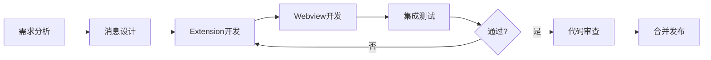

# 功能点开发标准流程指南

> 本文档提供 VS Code Extension 功能点开发的标准化流程，确保开发规范统一、代码质量可控。

## 1. 流程概览

| 属性 | 说明 |
|------|------|
| 流程名称 | 功能点开发标准流程 |
| 所属领域 | VS Code 扩展开发 |
| 涉及模块 | Extension、Webview、Shared |
| 目标说明 | 规范化功能开发流程，提高开发效率和代码质量 |

### 流程总览图



## 2. 详细开发步骤

### 步骤 1：需求分析

**目标**：明确功能需求，确定技术方案

**检查清单**：
- [ ] 功能需要哪些 VS Code API？
- [ ] 是否需要 Webview 界面？
- [ ] 需要什么类型的用户交互？
- [ ] 是否需要持久化数据？
- [ ] 是否涉及文件操作？

**输出**：功能设计文档或简要说明

### 步骤 2：消息类型设计

**目标**：定义 Extension 与 Webview 之间的通信协议

**操作位置**：`shared/types/message.ts`

**模板**：

```typescript
// 1. 添加消息类型常量
export const MessageTypes = {
  // ... 现有类型
  
  // 新功能相关
  FEATURE_REQUEST: 'featureRequest',      // 请求消息
  FEATURE_RESPONSE: 'featureResponse',    // 响应消息
} as const;

// 2. 定义 Payload 接口
export interface FeatureRequestPayload {
  // 请求参数
  param1: string;
  param2?: number;
}

export interface FeatureResponsePayload {
  success: boolean;
  data?: {
    // 响应数据结构
  };
  error?: string;
}
```

**命名规范**：
- 请求消息：`XXX_REQUEST` 或动作名（如 `GET_FILE`、`ANALYZE_PROJECT`）
- 响应消息：`XXX_RESPONSE` 或结果名（如 `FILE_RESULT`、`ANALYZE_RESULT`）

### 步骤 3：Extension 开发

**目标**：实现后端业务逻辑

#### 3.1 添加消息处理

**操作位置**：`extension/webview/WebviewPanel.ts`

```typescript
private _handleMessage(message: WebviewMessage) {
  switch (message.type) {
    // ... 现有 case
    
    case MessageTypes.FEATURE_REQUEST:
      this._handleFeatureRequest(message.payload);
      break;
  }
}

private async _handleFeatureRequest(payload: FeatureRequestPayload) {
  try {
    // 1. 业务逻辑处理
    const result = await this.doSomething(payload);
    
    // 2. 发送成功响应
    this._panel.webview.postMessage({
      type: MessageTypes.FEATURE_RESPONSE,
      payload: { success: true, data: result }
    });
  } catch (error) {
    // 3. 发送错误响应
    this._panel.webview.postMessage({
      type: MessageTypes.FEATURE_RESPONSE,
      payload: { success: false, error: error.message }
    });
  }
}
```

#### 3.2 添加新命令（如需要）

**操作位置**：

1. `package.json` - 注册命令

```json
{
  "contributes": {
    "commands": [
      {
        "command": "my-extension.newFeature",
        "title": "My New Feature"
      }
    ]
  }
}
```

2. `extension/commands/newFeature.ts` - 命令处理器

```typescript
import * as vscode from 'vscode';

export async function newFeature(context: vscode.ExtensionContext) {
  // 命令执行逻辑
  vscode.window.showInformationMessage('Feature executed!');
}
```

3. `extension/index.ts` - 注册命令

```typescript
import { newFeature } from './commands/newFeature';

export function activate(context: vscode.ExtensionContext) {
  context.subscriptions.push(
    vscode.commands.registerCommand('my-extension.newFeature', () =>
      newFeature(context)
    )
  );
}
```

### 步骤 4：Webview 开发

**目标**：实现前端 UI 和交互逻辑

#### 4.1 创建组件

**操作位置**：`webview/src/components/`

```vue
<!-- FeatureComponent.vue -->
<template>
  <div class="feature-container">
    <h2>{{ title }}</h2>
    
    <!-- 操作按钮 -->
    <button @click="handleAction" :disabled="loading">
      {{ loading ? '处理中...' : '执行操作' }}
    </button>
    
    <!-- 结果展示 -->
    <div v-if="result" class="result">
      <pre>{{ result }}</pre>
    </div>
    
    <!-- 错误提示 -->
    <div v-if="error" class="error">
      {{ error }}
    </div>
  </div>
</template>

<script setup lang="ts">
import { ref, onMounted, onUnmounted } from 'vue';
import { vscode } from '@/api/vscode';
import { MessageTypes } from '@shared/types/message';
import type { FeatureResponsePayload } from '@shared/types/message';

defineProps<{
  title: string;
}>();

const loading = ref(false);
const result = ref<any>(null);
const error = ref<string>('');

// 发送请求
function handleAction() {
  loading.value = true;
  error.value = '';
  
  vscode.postMessage({
    type: MessageTypes.FEATURE_REQUEST,
    payload: { param1: 'value' }
  });
}

// 处理响应
function handleMessage(event: MessageEvent) {
  const message = event.data;
  
  if (message.type === MessageTypes.FEATURE_RESPONSE) {
    loading.value = false;
    const payload = message.payload as FeatureResponsePayload;
    
    if (payload.success) {
      result.value = payload.data;
    } else {
      error.value = payload.error || '操作失败';
    }
  }
}

onMounted(() => {
  window.addEventListener('message', handleMessage);
});

onUnmounted(() => {
  window.removeEventListener('message', handleMessage);
});
</script>

<style scoped>
.feature-container {
  padding: 16px;
}

button {
  background: var(--vscode-button-background);
  color: var(--vscode-button-foreground);
  border: none;
  padding: 8px 16px;
  border-radius: 4px;
  cursor: pointer;
}

button:disabled {
  opacity: 0.6;
  cursor: not-allowed;
}

.result {
  margin-top: 16px;
  padding: 12px;
  background: var(--vscode-textBlockQuote-background);
  border-radius: 4px;
}

.error {
  margin-top: 16px;
  padding: 12px;
  background: var(--vscode-inputValidation-errorBackground);
  border: 1px solid var(--vscode-inputValidation-errorBorder);
  border-radius: 4px;
}
</style>
```

#### 4.2 集成到 App.vue

```vue
<template>
  <div class="app-container">
    <!-- 现有内容 -->
    
    <!-- 新功能组件 -->
    <FeatureComponent title="新功能" />
  </div>
</template>

<script setup lang="ts">
import FeatureComponent from './components/FeatureComponent.vue';
</script>
```

### 步骤 5：构建与测试

#### 5.1 构建项目

```bash
# 完整构建
npm run build

# 或分开构建
npm run build:ext   # 只构建 Extension
npm run build:web   # 只构建 Webview
```

#### 5.2 调试运行

1. 按 **F5** 启动调试
2. 在新窗口中按 `Ctrl+Shift+P`
3. 输入命令打开 Webview
4. 测试功能交互

#### 5.3 测试检查清单

- [ ] 消息发送正常
- [ ] 响应接收正确
- [ ] 错误处理有效
- [ ] Loading 状态正确
- [ ] UI 样式符合 VS Code 主题
- [ ] 无控制台错误

## 3. 代码组织规范

### 3.1 文件命名

| 类型 | 命名规则 | 示例 |
|------|----------|------|
| 命令处理器 | camelCase.ts | `openWebview.ts`, `analyzeProject.ts` |
| Vue 组件 | PascalCase.vue | `FeatureComponent.vue`, `FileTree.vue` |
| 工具函数 | camelCase.ts | `fileUtils.ts`, `messageHelper.ts` |
| 类型定义 | camelCase.ts | `message.ts`, `fileInfo.ts` |

### 3.2 目录结构

```
extension/
├─ commands/          # 命令处理器（每个命令一个文件）
├─ services/          # 业务服务（可复用逻辑）
├─ webview/           # Webview 管理
└─ utils/             # 工具函数

webview/src/
├─ api/               # 外部 API 封装
├─ components/        # Vue 组件
├─ composables/       # Vue 组合式函数
├─ stores/            # Pinia 状态管理
├─ styles/            # 全局样式
└─ utils/             # 工具函数
```

### 3.3 消息类型组织

```typescript
// shared/types/message.ts

// 基础消息接口
export interface WebviewMessage<T = any> { ... }

// 消息类型常量（按功能分组）
export const MessageTypes = {
  // 基础通信
  PING: 'ping',
  PONG: 'pong',
  
  // 通知类
  SHOW_INFO: 'showInfo',
  SHOW_ERROR: 'showError',
  
  // 文件操作
  GET_FILE: 'getFile',
  FILE_RESULT: 'fileResult',
  
  // 项目分析
  ANALYZE_PROJECT: 'analyzeProject',
  ANALYZE_RESULT: 'analyzeResult',
} as const;

// Payload 类型定义（与消息类型对应）
export interface GetFilePayload { ... }
export interface FileResultPayload { ... }
```

## 4. 常见模式

### 4.1 请求-响应模式

适用于：获取数据、执行操作后需要结果

```typescript
// Webview 发送请求
vscode.postMessage({ type: 'getData', payload: { id: 1 } });

// Extension 处理并响应
case 'getData':
  const data = await fetchData(payload.id);
  panel.webview.postMessage({ type: 'dataResult', payload: data });
  break;

// Webview 接收响应
if (message.type === 'dataResult') {
  state.value = message.payload;
}
```

### 4.2 通知模式

适用于：单向通知，无需响应

```typescript
// Webview 通知 Extension 显示消息
vscode.postMessage({ type: 'showInfo', payload: '操作成功！' });

// Extension 处理
case 'showInfo':
  vscode.window.showInformationMessage(payload);
  break;  // 无需响应
```

### 4.3 状态同步模式

适用于：Extension 主动推送状态变化

```typescript
// Extension 监听变化并推送
vscode.workspace.onDidChangeConfiguration(e => {
  if (e.affectsConfiguration('myExtension')) {
    panel.webview.postMessage({
      type: 'configChanged',
      payload: getNewConfig()
    });
  }
});

// Webview 接收并更新
if (message.type === 'configChanged') {
  config.value = message.payload;
}
```

## 5. 调试技巧

### 5.1 Extension 调试

```typescript
// 使用 console.log（输出到调试控制台）
console.log('Message received:', message);

// 使用 VS Code 输出通道
const outputChannel = vscode.window.createOutputChannel('My Extension');
outputChannel.appendLine('Debug info');
outputChannel.show();
```

### 5.2 Webview 调试

1. 在调试的 VS Code 窗口中按 `Ctrl+Shift+I` 打开开发者工具
2. 查看 Console 输出
3. 使用 Network 面板检查资源加载

```typescript
// Webview 中使用 console.log
console.log('Received message:', message);
```

### 5.3 消息追踪

```typescript
// Extension 端添加日志
this._panel.webview.onDidReceiveMessage((message) => {
  console.log('[EXT] Received:', JSON.stringify(message));
  this._handleMessage(message);
});

// Webview 端添加日志
window.addEventListener('message', (event) => {
  console.log('[WV] Received:', JSON.stringify(event.data));
});
```

## 6. 版本与变更记录

| 版本 | 日期 | 变更内容 | 作者 |
|------|------|----------|------|
| 1.0.0 | 2025-12-30 | 初始版本，功能点开发标准流程 | AI Assistant |
