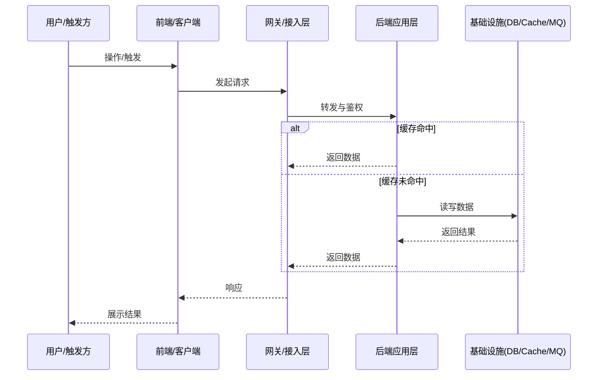

# skill-maintainer 通用维护参考

本文档是 **通用的系统梳理与维护方法论**，用于把 skill-maintainer 应用到任意系统代码（前端/后端/全栈/多仓库/单体/微服务）。

目标是：当你要“更新一个既有 SKILL”或“为某条业务流程补齐/更新标准化 workflow 文档”时，能用一致的阶段步骤完成 **调研 → 抽象 → 产出 → 校验 → 维护** 的闭环。

> 约束：本文档**不绑定**任何具体项目路径、类名、框架或语言；仅提供可迁移的方法与示例格式。

---

## 1. 总体原则（先把方向定对）

1. **以业务流程为核心，不以代码结构为核心**
   - 文档首先回答“用户完成一次任务会经历什么”，再映射到系统的模块与交互。

2. **先定边界，再谈细节**
   - 明确“流程入口/出口、参与方、数据边界、权限边界、租户边界”，否则文档会失焦。

3. **不做伪完整**
   - 不确定的部分要标为“待确认项”并列出验证方式，而不是靠猜。

4. **可维护性优先**
   - 结构稳定（按模板），内容可增量更新（变更记录），引用可追溯（文件清单/接口清单）。

---

## 2. 阶段化工作流（系统级梳理：从 0 到可维护）

下面的阶段步骤适用于两类任务：
- **A. 更新既有 SKILL**（结构/描述/路由/清单的维护）
- **B. 生成/更新 workflow 文档**（按模板输出标准化流程文档）

### 阶段 0：明确任务类型与交付物

1. **选择任务类型**
   - 仅修正文档：结构不变、补齐缺失章节、更新变更记录。
   - 流程重构：重新划分步骤与边界，可能影响多个文档与导航。
   - 内容迁移：把分散内容合并/拆分到更合适的 modules/workflows 下。

2. **明确交付物**
   - workflow 文档：是否新建？还是更新？是否需要新增 mermaid 时序图？
   - 文件清单：是否需要补齐“涉及文件清单”？
   - 维护要点：是否需要补齐“常见问题与整改建议”？

3. **明确验收标准（必须可验证）**
   - 文档结构与模板一致。
   - 流程步骤可从入口走到出口，没有“跳步”。
   - 清单可追溯：每个关键点能定位到相关文件/模块（但文档中不写具体代码）。

---

### 阶段 1：业务语义梳理（不看代码也能讲清楚）

1. **定义业务目标**
   - 用户要达成什么结果？
   - 系统为此必须保证什么约束（安全/一致性/审计/性能）？

2. **识别参与方（Actors）**
   - 人（用户/管理员/审核人）
   - 系统（前端/网关/后端服务/第三方）
   - 定时任务/消息消费者（如果是异步流程）

3. **识别核心对象（Domain Objects）**
   - 关键业务对象（例如“配置项”“订单”“工单”）
   - 生命周期状态（创建→变更→生效→失效）

4. **定义边界与约束**
   - 认证/授权边界：谁可以做什么
   - 数据隔离边界：租户/组织/数据权限
   - 幂等边界：哪些操作不可重复执行
   - 一致性边界：哪些地方强一致、哪些允许最终一致

输出（阶段 1 的产出）：
- 一段“流程概览”草稿（名称/目标/所属领域/涉及模块类型）
- 参与方与对象清单（用于后续时序图）

---

### 阶段 2：系统结构扫描（建立“地图”，不陷入细节）

1. **识别系统分层与职责**（通用视角）
   - 接入层：前端/客户端/网关/边缘层
   - 应用层：API/Controller/Handler/Resolver
   - 领域层：Domain Service/Manager/Use Case
   - 基础设施层：存储/缓存/消息/搜索/对象存储

2. **识别关键横切能力**
   - 安全：认证、授权、审计
   - 数据：多租户、数据权限、加解密、脱敏
   - 稳定性：限流、熔断、重试、超时
   - 可靠性：幂等、防重复提交、补偿
   - 性能：缓存、批处理、分页、异步化

3. **建立“文件清单”基线**
   - 只描述“类别 + 作用”，不写具体代码。
   - 目标是：读者知道去哪里找实现，而不是在文档里复制实现。

输出（阶段 2 的产出）：
- “涉及文件清单”初稿（按层次/模块分组）
- 横切能力映射点清单（后续写第 3 节）

---

### 阶段 3：流程时序还原（从入口到出口，补齐分支）

1. **定义流程入口与触发方式**
   - 用户操作触发 / 系统定时触发 / 事件触发

2. **梳理主链路（Happy Path）**
   - 用 5~10 步描述从入口到成功结束。
   - 每步只包含：输入→处理→输出。

3. **梳理关键分支（Unhappy Paths）**
   - 鉴权失败
   - 参数校验失败
   - 资源不存在/冲突
   - 并发更新/重复请求
   - 下游服务失败/超时

4. **沉淀时序图（mermaid）**
   - 参与方命名使用“角色/组件类别”，不要写具体类名。
   - 分支必须使用 `alt/else` 表达。

输出（阶段 3 的产出）：
- “流程步骤（时序）”完整可读版本
- 一张可渲染的 mermaid `sequenceDiagram`

---

### 阶段 4：能力关联与设计解释（把“为什么”讲清楚）

以“能力 → 触发点 → 风险 → 维护要点”的结构写第 3 节（与基础能力关联）。

推荐覆盖：
- 权限与数据权限
- 多租户/数据隔离
- 幂等/防重复
- 缓存/一致性
- 事务/最终一致（适用于后端）
- 前端缓存/本地存储/状态管理（适用于前端）
- 日志审计与可观测性

输出（阶段 4 的产出）：
- 可执行的维护要点：出现问题时应该先查什么、如何定位

---

### 阶段 5：接口与数据结构抽象（只写“对理解有用的”）

1. **接口清单（对外 + 对内）**
   - 对外接口：路径/方法/用途/关键入参/关键出参
   - 对内接口：事件/消息主题/任务/回调（如存在）

2. **数据结构说明**
   - 核心对象字段只列“业务含义 + 约束”，不要粘贴字段定义。
   - 标注“来源/去向”（来自请求？来自数据库？来自缓存？）

输出（阶段 5 的产出）：
- 一张接口表
- 一份核心对象字段说明（可用表格）

---

### 阶段 6：问题库与整改建议（让文档“可用”）

1. **常见问题分类**
   - 数据不一致类（缓存/异步造成）
   - 权限越界类（漏校验/误配置）
   - 并发幂等类（重复请求/竞态）
   - 性能退化类（N+1、缓存击穿、分页不当）
   - 可观测性不足（缺日志、缺 trace、无法定位）

2. **建议写法**
   - 每个问题：现象 → 可能原因 → 排查路径 → 修复方向 → 回归验证点

输出（阶段 6 的产出）：
- 至少 5 条可复用的问题与建议（可按项目裁剪）

---

### 阶段 7：整合与发布（把 SKILL 变成“入口可路由”）

1. **放置位置与引用**
   - workflow 文档放入目标模块的 `workflows/` 目录（或统一目录）。
   - 在对应 `SKILL.md` 中补齐导航引用。

2. **一致性检查**
   - 标题、流程名称、关键词与目录命名一致。
   - 模板章节齐全，顺序不乱。
   - “涉及文件清单”与“接口清单”不互相矛盾。

3. **变更记录**
   - 每次更新必须记录：原因、影响范围、是否需要联动更新其他文档。

输出（阶段 7 的产出）：
- 可被路由/查找的文档入口
- 最小变更集（不引入无关调整）

---

## 3. workflow 文档写作模板（通用版）

你可以按下面结构直接开写（与项目模板保持一致，但不写具体代码）：

```markdown
# {流程名称}

---

## 1. 流程概览

- **流程名称**：
- **所属领域**：
- **涉及模块**：
  - **后端模块**：
  - **前端模块**：
- **目标说明**：

---

## 2. 流程步骤（时序）

### 2.1 时序图



### 2.2 关键步骤拆解

1. **入口触发**：
2. **鉴权与参数校验**：
3. **业务校验与规则处理**：
4. **数据访问与一致性处理**：
5. **缓存/事件/异步处理**：
6. **响应组装与返回**：

---

## 3. 与系统基础能力的关联

- **权限与数据权限**：触发点、风险、维护要点
- **多租户/隔离**：触发点、风险、维护要点
- **幂等/防重复**：触发点、风险、维护要点
- **缓存/一致性**：触发点、风险、维护要点
- **日志审计/可观测性**：触发点、风险、维护要点

---

## 4. 关键数据结构与接口

### 4.1 核心对象（抽象）

| 对象 | 关键字段(业务含义) | 约束 | 来源/去向 |
|------|-------------------|------|----------|
| 对象 A | 字段1/字段2 | 必填/唯一/范围 | 请求/存储/缓存 |

### 4.2 接口清单（抽象）

| 接口类型 | 入口/事件 | 方法/动作 | 关键入参 | 关键出参 | 说明 |
|----------|-----------|----------|----------|----------|------|
| HTTP | /xxx | GET | a,b | x,y | 用途说明 |

---

## 5. 常见问题与整改建议

1. **问题**：现象…
   - **可能原因**：…
   - **排查路径**：…
   - **修复方向**：…
   - **回归验证**：…

---

## 6. 版本与变更记录

| 日期 | 版本 | 变更说明 | 作者 |
|------|------|----------|------|
| YYYY-MM-DD | v1.0 | 初始版本 | - |
```

---

## 4. 示例（只做格式示例，不绑定任何项目）

### 4.1 “只读查询型”流程示例要点

- 入口：用户发起查询
- 主链路：鉴权 → 参数校验 → 查询缓存/存储 → 组装响应 → 前端渲染
- 分支：无权限/参数非法/数据不存在/下游超时
- 维护要点：缓存一致性、分页性能、权限边界、异常提示一致性

### 4.2 “写入变更型”流程示例要点

- 入口：用户提交变更
- 主链路：鉴权 → 幂等校验 → 业务规则校验 → 写库 → 失效缓存/发事件 → 返回结果
- 分支：并发冲突/重复提交/规则不通过/下游失败
- 维护要点：事务边界、补偿策略、审计日志、回滚与重试

---

## 5. 常用检查清单（通用）

### 文档完整性

- [ ] 章节与模板一致
- [ ] 主链路完整、分支清晰
- [ ] 参与方命名抽象一致
- [ ] 能力关联覆盖关键横切点
- [ ] 接口表与对象表可读且不冗余

### 可维护性

- [ ] 变更记录补齐
- [ ] 待确认项列出验证方式
- [ ] 常见问题包含排查路径与回归点

### 一致性

- [ ] 流程名称、关键词、目录命名一致
- [ ] 术语前后一致（同一对象不多种叫法）
