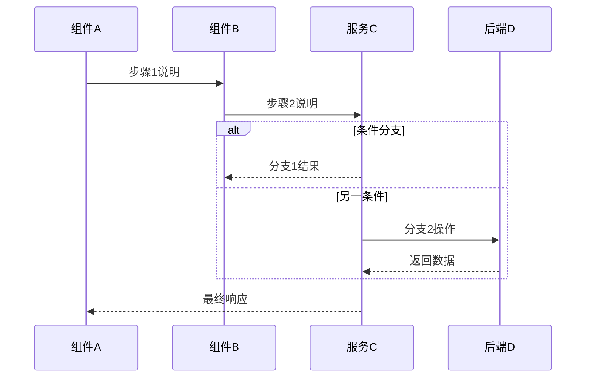

# 业务流程文档模板

> 本文件作为 **业务流程类文档** 的标准模板，用于生成 workflow 文档。
> 每个文档专注讲清一个完整业务流程：涉及的接口、权限、数据模型、与 cde-base 能力的关系。

---

## 1. 流程概览

- **流程名称**：例如「权限认证流程」/「登录流程」/「订单创建流程」
- **所属领域**：系统基础 / 用户与权限 / 业务模块 X / 运维等
- **涉及模块**：
  - 后端模块：示例 `cde-system`、`cde-admin`、`cde-workflow` 等
  - 前端模块：如 `plus-ui` 的页面路径或组件
- **目标说明**：
  - 这个流程的业务目标是什么？
  - 对最终用户 / 系统稳定性 / 安全性的关键意义。

> 示例：数据字典流程
> - 目标：实现系统配置项的统一管理，提供高效的字典加载机制。
> - 重要性：确保前后端数据定义一致性，减少硬编码。

---

## 2. 流程步骤（时序）

### 2.1 时序图

使用 mermaid 语法绘制时序图，直观展示各组件间的交互：

### 2.2 关键步骤拆解

（建议保持 5~10 步内）

1. **步骤 1 - 入口触发**：
   - 描述请求来源、入口点
   - 涉及的 Controller/组件

2. **步骤 2 - 参数校验/预处理**：
   - 网关/过滤器处理
   - 参数验证逻辑

3. **步骤 3 - 权限/数据权限校验**：
   - 与权限系统的交互
   - 数据权限过滤

4. **步骤 4 - 核心业务逻辑**：
   - 主要业务处理
   - 事务边界

5. **步骤 5 - 数据持久化**：
   - 数据库操作
   - 缓存更新

6. **步骤 6 - 响应组装**：
   - 结果转换
   - 返回格式

---

## 3. 与 cde-base 能力的关联

从"框架能力"的视角，对流程中的关键点进行映射。

### 3.1 权限 & 数据权限

- 使用了哪些权限控制方式？（角色、菜单、按钮级权限等）
- 是否涉及数据权限模型？
- 在流程中哪一步做了校验？

### 3.2 多租户

- 流程中如何识别和传递租户信息？
- 租户解析点和隔离策略

### 3.3 幂等与防重复提交

- 是否需要幂等控制？
- 使用了哪种幂等策略？

### 3.4 缓存机制

- 是否依赖缓存提高性能？
- 缓存 Key 设计
- 缓存更新策略

### 3.5 其他能力

- 动态数据源、加解密、数据脱敏等

---

## 4. 关键数据结构与接口

### 4.1 主要数据模型

- **实体类 (Entity)**：
  - 类名及关键字段说明

- **请求对象 (DTO/Bo)**：
  - 类名及关键字段说明

- **响应对象 (VO)**：
  - 类名及关键字段说明

### 4.2 关键接口列表

| 接口路径 | 方法 | 说明 | 前端调用方法 |
|----------|------|------|--------------|
| `/api/xxx` | GET | 描述 | `apiMethod()` |
| `/api/yyy` | POST | 描述 | `apiMethod()` |

---

## 5. 常见问题与整改建议

### 5.1 常见问题

1. **问题描述**
   - 现象
   - 原因分析

2. **问题描述**
   - 现象
   - 原因分析

### 5.2 整改建议

对应每个问题，给出具体的整改方案：

1. 针对问题1的解决方案
2. 针对问题2的解决方案

---

## 6. 版本与变更记录

| 日期 | 版本 | 变更说明 | 作者 |
|------|------|----------|------|
| YYYY-MM-DD | v1.0 | 初始版本 | - |
| YYYY-MM-DD | v1.1 | 补充xxx说明 | - |
